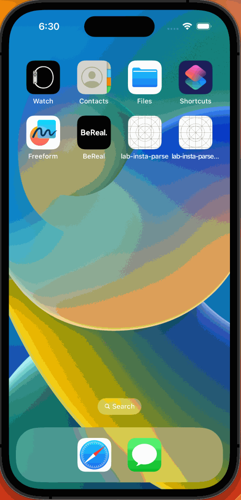

# Project 6 - *BeReal Clone Pt. 2*

Submitted by: **Kelly Bonilla Guzmán**

**BeReal Clone** is an app that clones some of the main functionalities of the trending app called BeReal. In this app, users post a photo of what they're currently doing upon receiving a random notification during the day. Only after posting a photo can the user see their friends' photos. [TODO] 

Time spent: **2** hours spent in total

## Required Features

The following **required** functionality is completed:

- [X] User can launch camera to take photo instead of photo library
- [X] User session persists when application is closed and relaunched
- [X] Users are able to log out and return to sign in page
- [X] Users are NOT able to see other photos until they upload their own	
 
The following **optional** features are implemented:

- [ ] User receive notifcation when it is time to post
- [ ] Users can make comments and view comments in posts	

The following **additional** features are implemented:

- [ ] List anything else that you can get done to improve the app functionality!

## Video Walkthrough

Here's a walkthrough of implemented user stories:

<!-- Replace this with whatever GIF tool you used! -->
GIF created with LICEcap
<!-- Recommended tools:
[Kap](https://getkap.co/) for macOS
[ScreenToGif](https://www.screentogif.com/) for Windows
[peek](https://github.com/phw/peek) for Linux. -->

## Notes

N/A.

## License

    Copyright 2023 Kelly Bonilla Guzman

    Licensed under the Apache License, Version 2.0 (the "License");
    you may not use this file except in compliance with the License.
    You may obtain a copy of the License at

        http://www.apache.org/licenses/LICENSE-2.0

    Unless required by applicable law or agreed to in writing, software
    distributed under the License is distributed on an "AS IS" BASIS,
    WITHOUT WARRANTIES OR CONDITIONS OF ANY KIND, either express or implied.
    See the License for the specific language governing permissions and
    limitations under the License.

# Project 5 - *BeReal Clone*

Submitted by: **Kelly Bonilla Guzmán**

**BeReal Clone* is an app that clones some of the main functionalities of the trending app called BeReal. In this app, users post a photo of what they're currently doing upon receiving a random notification during the day. Only after posting a photo can the user see their friends' photos.

Time spent: **3** hours spent in total

## Required Features

The following **required** functionality is completed:

- [X] User can register a new account
- [X] User can log in with newly created account
- [X] App has a feed of posts when user logs in
- [X] User can upload a new post which takes in a picture from photo library and a caption	
 
The following **optional** features are implemented:

- [ ] Users can pull to refresh their feed and see a loading indicator
- [ ] Users can infinite-scroll in their feed to see past the 10 most recent photos
- [ ] Users can see location and time of photo upload in the feed	
- [ ] User is able to logout
- [ ] User stays logged in when app is closed and open again	

The following **additional** features are implemented:

- [ ] List anything else that you can get done to improve the app functionality!

## Video Walkthrough

Here's a walkthrough of implemented user stories:

<!-- Replace this with whatever GIF tool you used! -->
GIF created with LICEcap
<!-- Recommended tools:
[Kap](https://getkap.co/) for macOS
[ScreenToGif](https://www.screentogif.com/) for Windows
[peek](https://github.com/phw/peek) for Linux. -->

## Notes

Struggled with autolayout constraints in the Table View Controller.

## License

    Copyright 2023 Kelly Bonilla Guzmán

    Licensed under the Apache License, Version 2.0 (the "License");
    you may not use this file except in compliance with the License.
    You may obtain a copy of the License at

        http://www.apache.org/licenses/LICENSE-2.0

    Unless required by applicable law or agreed to in writing, software
    distributed under the License is distributed on an "AS IS" BASIS,
    WITHOUT WARRANTIES OR CONDITIONS OF ANY KIND, either express or implied.
    See the License for the specific language governing permissions and
    limitations under the License.
